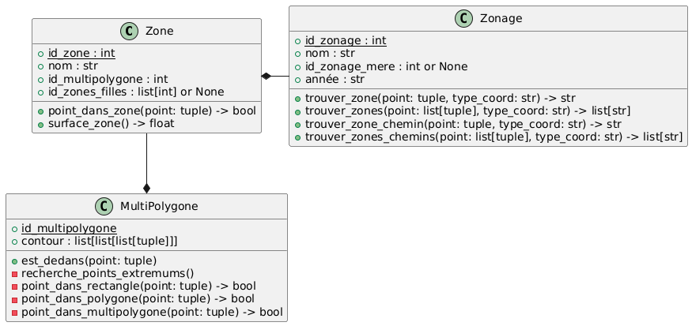

# Vous êtes ici 🎯
## Mise à jour du fichier requirements.txt
### Installation mode automatique
```
pip install -r requirements.txt
```

### Commande
```
pip freeze > requirements.txt
```
### Diagramme des Classes
