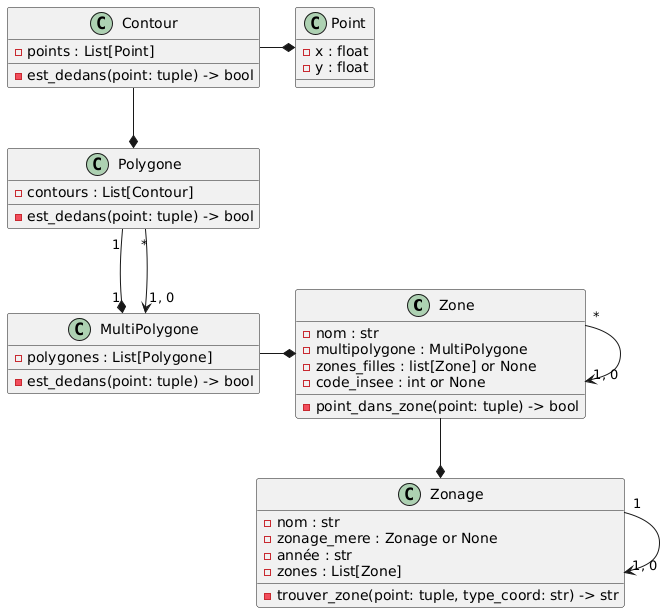

# Vous êtes ici 🎯
## Mise à jour du fichier requirements.txt
### Installation mode automatique
```
pip install -r requirements.txt
```

### Commande
```
pip freeze > requirements.txt
```
### Diagramme des Classes



## Sources de Données

Pour la réalisation de ce projet, nous nous appuyons sur le code officiel géographique de l'INSEE et sur les contours des différents zonages fournis par l'IGN au format Shapefile.

